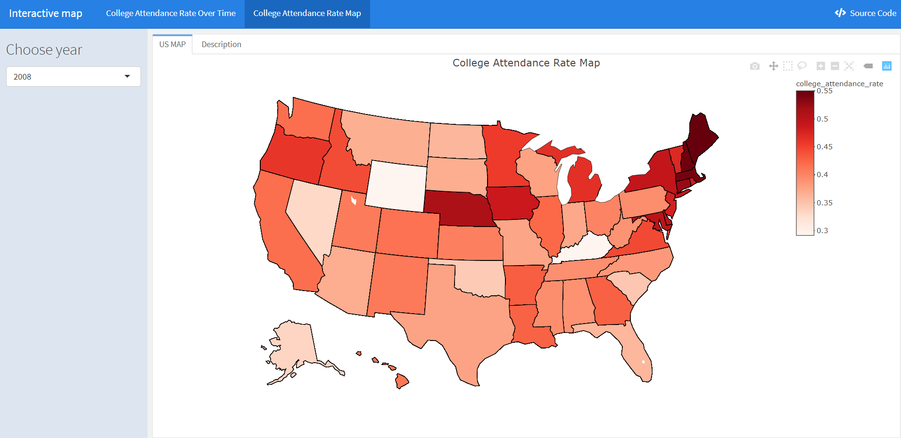

```{r setup, echo = FALSE, warning = FALSE, message = FALSE}
library(tidyverse)
library(corrplot)
library(modelr)
library(gganimate)
library(gifski)
library(plotly)

set.seed(1)

knitr::opts_chunk$set(
  fig.width = 12,
  fig.asp = .6,
  out.width = "90%"
)

theme_set(theme_minimal() + theme(legend.position = "bottom"))

options(
  ggplot2.continuous.colour = "viridis",
  ggplot2.continuous.fill = "viridis"
)

scale_colour_discrete = scale_colour_viridis_d
scale_fill_discrete = scale_fill_viridis_d

```
# Motiviation
It is undoubtedly that there are numerous of people are living in extreme poverty, and this also happened to the United States. One noticeable situation is that people with college or higher degrees are tend to earn more than others. Besides, one of the major social issues in the United States is the inequality in the higher education, and thus the college attendance rate really matters for reducing poverty in the United States. So our team is trying to find the relevant factors which influence the college attendance rate in the United States.  

# Related Work

The following resources are a sample of what inspired this project.

 * "The College Enrollment Rate of ACT-Tested Students Remains Stable" *ACT Research*, 2014. [Link.](http://www.act.org/content/act/en/research/reports/act-publications/college-choice-report-class-of-2014/enrollment/college-enrollment-rate.html)
 * "College Enrollment Rates" *The National Center for Education Statistics (NCES)*, May, 2020. [Link.](https://nces.ed.gov/programs/coe/indicator_cpb.asp)
 * "College Enrollment & Student Demographic Statistics" *EDUCATIONDATA.ORG*, June 7, 2019. [Link.](https://educationdata.org/college-enrollment-statistics)
 * "Is Your State Prioritizing TEACHER DIVERSITY & EQUITY?" *The Education Trust* [Link.](https://edtrust.org/)
 * "It's Time to Worry About College Enrollment Declines Among Black Students" *Center for American Progress*, September 28, 2020. [Link.](https://www.americanprogress.org/issues/education-postsecondary/reports/2020/09/28/490838/time-worry-college-enrollment-declines-among-black-students/)
 * College enrollment rate. *USAFACTS*. [Link.](https://usafacts.org/data/topics/people-society/education/higher-education/college-enrollment-rate/)

# Initial questions
Our initial goal is to investigated the association between college attendance rate and different factors. To be more specifically, we are interested in the trend of college attendance rate among different groups and to see if there is discrimination. Our questions are as follows:
 * Any association between different income groups and the college attendance rate?  
 * Any association between geography (states and if from an urban) and the college attendance rate?
 * Any association between races and the college attendance rate?  
 * Any association between different income groups and the school type?  
 * What are the important variables if we do a multiple linear regression?
 * How can we predict and visualize the college attendance rate among different groups?  

# Data

The dataset we are using is IMPUS which provides census and survey data from around the world integrated across time and space. 

Since we were interested in the college attendance rate, we filtered the dataset to only include age between 18 to 24 years old. Besides, we only keep part of the original dataset because it is too big, and the final cleaned data has around 120,000 rows. 

We considered people who were currently enrolled in the college (including students who take a gap year from the university) or have graduated from the college before as the numerator of the college attendance rate.  

Factors that we are interested in: 
  
 * year: Census year  
 * age: Age
 * states: States abbreviation  
 * race: Race  
 * number_of_children: Number of own children in the household  
 * college_attendance_status: if one is enrolled in the college  
 * school_type: Public or Private school  
 * anually_family_income: Total anually family income
# Interactive Plot  

### Interactive Plot of College Attendance Rate  
Given the collection of all available college attendance data, we are allowed to integrate a bunch of interactive plots. 


On the first tab *College Attendance Rate Over Time*, first of all, we can see the trend of the college attendance rate in the New York city for all races from 2008 to 2018, all metropolitan status, and all family income range; If we click *Select State* on the left side bar, it goes further into more specific geographical locations. If we click *Select Race* on the left, we are allowed to know further information about the college attendance rate for a specific race. If we slide *Annual Family Income* bar on the left, it gives the college attendance rate for detailed family income range. For the checkbox on the left, we're allowed to filter acoording to types of metropolitan status: mixed of metropolitan status, in metropolitan, and not in metropolitan area.       


### College Attendance Rate Map

We also build a interactive map which allows users to toggle between different years (2008-2018), visualizing regional differences across the U.S. 



By click *Choose year*, it goes further into more specific geographic locations for one specific year. 

# Exploratory Analysis

## Overview
In the exploratory analysis section, to take a deeper look at the college attendance rate, we plot the trend of overall college attendance rate across time and the college attendance rate stratified by metropolitan status, states, income, race, number of children. We also plot the proportion of different type of school across people with different incomes. 

## College attendance rate over time
The line chart shows the overall trend of college attendance rate of USA from 2008 to 2018. The college attendance rate was mainly increasing while it experienced two declines, one in 2009 and the other in 2016. In 2010, the overall college attendance rate saw its biggest growth.

```{r rate-year}
data_cleaned <- read.csv("./data/cleaned.csv")

rate_year <- data_cleaned %>%
        group_by(year) %>%
        summarize(rate = length(which(college_attendance_status=="Yes"))/n())

pyear = ggplot(rate_year, aes(x=year, y=rate)) +
        geom_line() +
        geom_point() +
        labs(title = "Trend Over Time", x="Year", y= "College Attendence Rate") +
        scale_x_continuous(breaks = seq(2008, 2018, 2)) +
        transition_reveal(year)
animate(pyear, duration = 5, fps = 20, width = 400, height = 400, renderer = gifski_renderer())
```
  
## College attendance rate by Metropolitan
The chart shows college attendance rate from 2008-2018, by metropolitan status. People in metropolitan and central city had the highest college attendance rate, while people not in metropolitan area had the lowest college attendance rate.


```{r byCity}
rate_city <- data_cleaned %>%
        group_by(year, metropolitan_status) %>%
        summarize(rate = length(which(college_attendance_status=="Yes"))/n())
        # pivot_wider(names_from =metropolitan_status, values_from = rate)

pcity = ggplot(rate_city, aes(x=year, y=rate, color = metropolitan_status)) +
        geom_line() +
        geom_point() +
        scale_x_continuous(breaks = seq(2008, 2018, 2)) + 
        labs(title = "Trend Over Time by Metropolitan", x="Year", y= "College Attendence Rate") +
        transition_reveal(year)
animate(pcity, duration = 5, fps = 20, width = 600, height = 400, renderer = gifski_renderer())

                       
# plot_ly(rate_city, x=~year, y=~`in metropolitan and central city`, name = "in metropolitan and central city", type = "scatter", mode = "line") %>%
#         add_trace(y=~`in metropolitian but mixed of central city`, name = "in metropolitian but mixed of central city", type = "scatter", mode = "line") %>%
#         add_trace(y=~`in metropolitian but not in central city`, name = "in metropolitian but not in central city", type = "scatter", mode = "line") %>%
#         add_trace(y=~`mixed of metropolitian status`, name = "mixed of metropolitian status", type = "scatter", mode = "line") %>%
#         add_trace(y=~`Not in metropolitan area`, name = "Not in metropolitan area", type = "scatter", mode = "line")# plot_ly(rate_city, x=~year, y=~`in metropolitan and central city`, name = "in metropolitan and central city", type = "scatter", mode = "line") %>%
#         add_trace(y=~`in metropolitian but mixed of central city`, name = "in metropolitian but mixed of central city", type = "scatter", mode = "line") %>%
#         add_trace(y=~`in metropolitian but not in central city`, name = "in metropolitian but not in central city", type = "scatter", mode = "line") %>%
#         add_trace(y=~`mixed of metropolitian status`, name = "mixed of metropolitian status", type = "scatter", mode = "line") %>%
#         add_trace(y=~`Not in metropolitan area`, name = "Not in metropolitan area", type = "scatter", mode = "line")

```
## College attendance rate by State
The chart shows the changes of the ranking of different states across time. Generally, the top 5 states with the highest college attendance rate were DC, NJ, CT, MA and VT, all higher than 0.5.The top 5 states with the lowest college attendance rate were AK, OK, NV, LA and AZ, all lower than 0.38.


```{r byState}
rate_state <- data_cleaned %>%
        group_by(year, states) %>%
        summarize(rate = length(which(college_attendance_status=="Yes"))/n()) %>%
        mutate(rank = min_rank(-rate)) %>%
        ungroup()
        # pivot_wider(names_from =metropolitan_status, values_from = rate)

pstate <-ggplot(rate_state,aes(rank,group=states,fill=as.factor(states),color=as.factor(states))) +
 geom_tile(aes(y = rate/2,height = rate, width = 0.9), alpha = 0.8, color = NA) +
 geom_text(aes(y = 0, label = paste(states, ' ')), vjust = 0.2, hjust = 1) +
 geom_text(aes(y=rate,label = paste(' ',rate)), hjust=0)+
 coord_flip(clip = 'off', expand = TRUE) +
 scale_y_continuous(labels = scales::comma) +
 scale_x_reverse() +
 guides(color = FALSE, fill = FALSE) +
 theme_minimal() +
 theme(
 plot.title=element_text(size=25, hjust=0.5, face='bold', colour='grey', vjust=-1),
 plot.subtitle=element_text(size=18, hjust=0.5, face='italic', color='grey'),
 plot.caption =element_text(size=8, hjust=0.5, face='italic', color='grey'),
 axis.ticks.y = element_blank(), 
 axis.text.y = element_blank(), 
 plot.margin = margin(1,1,1,4, 'cm')
 )


pstate <- pstate + transition_states(states = year, transition_length = 4, state_length = 1) + 
 ease_aes('cubic-in-out') +
 labs(title = 'College Attendance Rate per Year : {closest_state}', 
 x='',y='Total Suicides per year')

animate(pstate,fps = 20,duration = 30, width = 950, height = 750, renderer = gifski_renderer())

# 
# pstate = ggplot(rate_state, aes(x=rank, y=rate, color = states)) +
#         geom_tile(aes(y = rank, height = rate, width = .9, color = NA))+
#         geom_text(aes(y = 0, label = paste(states, ' ')), vjust = 0.2, hjust = 1) +
#  geom_text(aes(y=rate,label = paste(' ',rate)), hjust=0)+
#         coord_flip(clip = 'off', expand = TRUE) +
#         scale_y_continuous(labels = scales::comma) + 
#         scale_x_reverse() +
#         guides(color = FALSE, fill = FALSE) +
#         labs(title = "College Attendance Rate by State", y="Year", x= "College Attendence Rate")
#         transition_reveal(year)
#         
# pstate
```
## College attendance rate by Income
The chart shows college attendance rate from 2008-2018, by income. High income families have the highest college attendance rate until 2015, when low income families surpassed them. Families with middle income had lowest college attendance rate during the whole time period and was the main reason the overall college attendance rate dropped in 2016.


```{r byIncome}
data_omitna <- na.omit(data_cleaned)
rate_income <-  data_omitna%>%
                mutate(income = car::recode(`anually_family_income`, "lo:20000 = 'low';94500:hi='high';else = 'middle'")) %>%
        # mutate(income = car::recode(`anually_family_income`, "lo:median(data_omitna$anually_family_income)*0.3 = 'low';median(data_omitna$anually_family_income)*2:hi='high';else = 'middle'")) %>%
        group_by(year, income) %>%
        summarize(rate = length(which(college_attendance_status=="Yes"))/n())
        # pivot_wider(names_from =income, values_from = rate)

pincome = ggplot(rate_income, aes(x=year, y=rate, color = income)) +
        geom_line() +
        geom_point() +
        scale_x_continuous(breaks = seq(2008, 2018, 2)) + 
        labs(title = "Trend Over Time by Income", x="Year", y= "College Attendence Rate") +
        transition_reveal(year)
animate(pincome, duration = 5, fps = 20, width = 600, height = 400, renderer = gifski_renderer())
# plot_ly(rate_income, x=~year, y=~`high`, name = "high income", type = "scatter", mode = "line") %>%
#         add_trace(y=~`middle`, name = "middle income", type = "scatter", mode = "line") %>%
#         add_trace(y=~`low`, name = "low income", type = "scatter", mode = "line")

```
## College attendance rate by Race
The chart shows college attendance rate from 2008-2018, by race. Generally, Chinese had the highest college attendance rate, followed by other Asian or Pacific islanders and white people. American Indian of Alaska native had the lowest college attendance rate. The college attendance rate of Japanese increased rapidly before 2012 and had a dramatic drop in 2017.

```{r byRace}
rate_race <- data_cleaned %>%
        group_by(year, race) %>%
        summarize(rate = length(which(college_attendance_status=="Yes"))/n())
        # pivot_wider(names_from =race, values_from = rate)

prace = ggplot(rate_race, aes(x=year, y=rate, color = race)) +
        geom_line() +
        geom_point() +
        scale_x_continuous(breaks = seq(2008, 2018, 2)) + 
        labs(title = "Trend Over Time by Race", x="Year", y= "College Attendence Rate") +
        transition_reveal(year)
animate(prace, duration = 5, fps = 20, width = 600, height = 400, renderer = gifski_renderer())

# plot_ly(rate_race, x=~year, y=~`White`, name = "White", type = "scatter", mode = "line") %>%
#         add_trace(y=~`African American`, name = "African American", type = "scatter", mode = "line") %>%
#         add_trace(y=~`American Indian or Alaska Native`, name = "American Indian or Alaska Native", type = "scatter", mode = "line") %>%
#         add_trace(y=~`Other Asian or Pacific Islander`, name = "Other Asian or Pacific Islander", type = "scatter", mode = "line") %>%
#         add_trace(y=~`Chinese`, name = "Chinese", type = "scatter", mode = "line") %>%
#         add_trace(y=~`Japanese`, name = "Japanese", type = "scatter", mode = "line") %>%
#         add_trace(y=~`Others`, name = "others", type = "scatter", mode = "line")
```
## College attendance rate by Number Of Children
The chart shows college attendance rate from 2008-2018, by the number of children in the family. Generally, the more children in the family, the lower the college attendance rate.


```{r byNumberOfChildren}
 rate_noc <-  data_omitna%>%
                mutate(noc = car::recode(`number_of_children`, "0 = '0'; 1:2 = '1-2';3:hi='3+'")) %>%
        group_by(year, noc) %>%
        summarize(rate = length(which(college_attendance_status=="Yes"))/n())
        # pivot_wider(names_from =noc, values_from = rate)

pnoc = ggplot(rate_noc, aes(x=year, y=rate, color = noc)) +
        geom_line() +
        geom_point() +
        scale_x_continuous(breaks = seq(2008, 2018, 2)) + 
        labs(title = "Trend Over Time by Number of Children", x="Year", y= "College Attendence Rate") +
        transition_reveal(year)
animate(pnoc, duration = 5, fps = 20, width = 600, height = 400, renderer = gifski_renderer())

# plot_ly(rate_noc, x=~year, y=~`0`, name = "0 children", type = "scatter", mode = "line") %>%
#         add_trace(y=~`1-2`, name = "1-2 children", type = "scatter", mode = "line") %>%
#         add_trace(y=~`3+`, name = "3+ children", type = "scatter", mode = "line")
# rate_noc$frame = rate_noc$year
# plot_ly(rate_noc, x = ~year, y = ~rate, split = ~noc, frame = ~frame, type = 'scatter', mode = 'lines', line = list(simplyfy = F)) 
        # animation_opts(frame = 100, transition = 0, redraw = FALSE) %>%
        # animation_slider(hide = T) %>% 
        # animation_button(x = 1, xanchor = "right", y = 0, yanchor = "bottom")
```

## College attendance rate by Type Of School
The chart shows proportion of different type of school across people with different incomes from 2008 to 2018. High income people had relatively higher percentage of entering private school and relatively lower rate of non-enrollment among all people.

```{r bySchoolType}
n_school <- data_omitna %>%
        mutate(income = car::recode(`anually_family_income`, "lo:20000 = 'low';94500:hi='high';else = 'middle'"),
               income = factor(income, levels = c("low","middle","high")))
school_incomee = 
        n_school %>% 
        group_by(year, income) %>%
        summarize(income_group = n()) 
school_typee = 
        n_school %>% 
        group_by(year, income, school_type) %>% 
        summarize(number = n()) %>% 
        left_join(school_incomee, by = c("year","income")) %>% 
        mutate(percentage = 100*number/income_group)
plot_ly(school_typee, x=~year, y = ~percentage, color = ~school_type, frame = ~income, type = "scatter", mode = "line")
# plot_ly(rate_school, x=~year, y=~`Private school`, name = "Private school", type = "scatter", mode = "line") %>%
#         add_trace(y=~`Public school`, name = "Public school", type = "scatter", mode = "line") %>%
#         add_trace(y=~`Not enrolled`, name = "Not enrolled", type = "scatter", mode = "line")
```

# Statistical Analysis

### Overview

In the [regression analysis](regression.html), we mainly focus on finding associations between the college attendance rate and several factors, including income, race, city type, and the number of children.   

First, we plotted several bar graphs showing the data compositions under each variable of interest, and found out there was not too much variance of data distribution across years.   

Then, a correlation matrix was generated to see if there exists multicollinearity between covariates. Considering the "chaos" in the distribution of outcome values (meaning our data did not follow a certain distribution), we have tried different models to fit in our full dataset, but the results were unsatisfactory.  

Thus, we switched back to linear regression models but awared of potential inaccuracy and bias of results. We also did stratified analysis based on race (African Americans vs Non-African Ameircans).   

In addition, we applied model diagnostics to evaluate model assumptions and check influential effects. Given the diagnostics, a linear regression used logit transformation was included in the end to meet assumptions but modeled with filtered dataset.

```{r echo = FALSE, warning = FALSE, message = FALSE}
## Import and tidy raw data
## Recode college variable: attend college (Yes) coded as "1", not attend (No) coded as "0"
## Recode city variable for conciseness
## Leave out "NA" from income variable
tidied = 
  read.csv("./data/cleaned.csv") %>%
  rename(city = metropolitan_status,
         noc = number_of_children,
         college = college_attendance_status,
         income = anually_family_income) %>%
  mutate(city = as.factor(city),
         college = as.numeric(recode(college, "Yes" = "1", "No" = "0")),
         race = as.factor(race),
         noc = as.factor(noc),
         city = recode(city, "in metropolitian but mixed of central city" = "metro mixed central", "in metropolitan and central city" = "metro & central", "in metropolitan but not in central city" = "metro not central", "mixed of metropolitian status" = "mixed metro", "Not in metropolitan area" = "non-metro","in metropolitian but not in central city" = "metro not central"),
         race = recode(race, "American Indian or Alaska Native" = "AmeInd/AK", "Other Asian or Pacific Islander" = "Asian/Pacific", "in metropolitian but not in central city" = "metro not central")) %>%
  drop_na(income)

## Compute outcome variable for regression: Percent = 100*number of people attending college/total number of people
all = 
  tidied %>%
  mutate(race = fct_infreq(race),
         city = fct_infreq(city),
         noc = fct_inseq(noc)) %>%
  group_by(year, age, city, race, noc, states) %>%
  mutate(count = "1",
         count = as.numeric(count),
         income = income/10000,
         percent = 100*sum(college)/sum(count)) %>%
  ungroup()
```

### Correlation Matrix

```{r echo = FALSE, warning = FALSE, message = FALSE}
## Generate a correlatin matrix to check if there exists multicollinearity among covariates
corr_data = 
  cor(cbind(enrollment_rate = pull(all, percent),
        model.matrix(percent~income + race + city + noc, data = all)[,-1])
  )

corr_data %>% 
  corrplot(method = "color", addCoef.col = "black", tl.col = "black", tl.srt = 45, insig = "blank" , number.cex = 0.7, diag = FALSE)


```

**Findings:** From the correlation matrix, it could be observed that the correlation between any two subgroups of predictors is less than 0.3, indicating there is a weak or no correlation between covariates and less likely to have multicollinearity. The predictors tend to be independent of each other.  Values less than 0 indicate a negative correlation; values greater than 0 indicate a positive correlation. 


### Modeling

Linear regression model fitting all data points: 

$$ \hat{percent} = \beta_0 + \beta_1income + \beta_2race + \beta_3city + \beta_4noc$$

```{r echo = FALSE, warning = FALSE, message = FALSE}
## Linear regression with all data points included
## Tidy the regression results
fit_linear = lm(percent~income + race + city + noc, data = all)

fit_linear %>%
  broom::tidy() %>%
  mutate(term = str_replace(term, "^race", "Race:"),
         term = str_replace(term, "^city", "City:"),
         term = str_replace(term, "^noc", "NOC:")) %>%
  knitr::kable(digits = 3)
  
```

**Findings:** The results of the multiple linear regression show there is a significant association between annually family income and college attendance rate, however, the interesting part is there is actually a negative effect on the college attendant rate, but if we look through the overall trend plot from [here](plot.html) between income and college attendant rate, we can find that it should be a positive association, and thus we did 2 further regressions after stratifying the race in this section. However, the association between race groups of American Indian/Alaska Natives and attendance rate is not significant, compared to the White. In addition, for one unit increase in "city", the estimated college attendance rate will decrease to some extent, adjusting for other predictors. For the predictor NOC, the significant association is only observed for the group of 1 or 2 children in the family.

#### Stratified modeling for Race: African American 

$$ \hat{percent} = \beta_0 + \beta_1income + \beta_2city + \beta_3noc$$
```{r echo = FALSE, warning = FALSE, message = FALSE}
## Stratified analysis for the subgroup of African American since a lot of percent "0"s fall in this subpopulation
AA_df = all %>% 
  filter(race == "African American")
fit_AA = lm(percent~income  + city + noc, data = AA_df)
fit_AA %>%
  broom::tidy() %>%
  mutate(term = str_replace(term, "^race", "Race:"),
         term = str_replace(term, "^city", "City:"),
         term = str_replace(term, "^noc", "NOC:")) %>%
  knitr::kable(digits = 3)
```

#### Stratified modeling for Race: Non-African American 

```{r echo = FALSE, warning = FALSE, message = FALSE}
## Stratified analysis for groups other than African American to see if the results are discriminating among subgroups of race variable
Other_df = all %>% 
  filter(race != "African American")
fit_other = lm(percent~income  + city + noc, data = Other_df)
fit_other %>%
  broom::tidy() %>%
  mutate(term = str_replace(term, "^race", "Race:"),
         term = str_replace(term, "^city", "City:"),
         term = str_replace(term, "^noc", "NOC:")) %>%
  knitr::kable(digits = 3)
```

**Findings:** The two regression models show a significantly difference in the coefficient of income, and this might suggest several discrimination.


### Model Diagnostics

```{r echo = FALSE, warning = FALSE, message = FALSE}
par(mfrow=c(2,2))
plot(fit_linear)
```

**Findings:** The residuals are not quite normally distributed especially near both ends. Residuals are shown with a mean of 0. A few outliers are observed in the "Residuals vs Leverage" plot, and one of them has influenced the accuracy of regression given the large cook's distance. Plus, residuals are biased around the horizontal line. Thus, the assumptions of linear models are not completely supported. 


### Logit Transformation

Given the results of linear regression with raw data, the following analysis is based on transformed percent values. Original values of 0 and 1 are transformed to "-Inf" and "Inf" respectively, thus cannot be included in regression analysis. 

$$ percent^* = \beta_0 + \beta_1income + \beta_2race + \beta_3city + \beta_4noc$$
Transformation: $$ percent^* = log(\frac{percent}{100-percent})$$

```{r echo = FALSE, warning = FALSE, message = FALSE}
## Compute logit transformation and MLR for only non-extreme outcome values (0 and 1)
transf = all %>%
  mutate(transf_percent = log(percent/(100-percent))) %>%
  filter(transf_percent != "-Inf",
         transf_percent != "Inf")

fit_logit = lm(transf_percent~income + race + city + noc, data = transf)
par(mfrow=c(2,2))
plot(fit_logit)
```

**Findings:** After transformation and filtration of data, the residuals are distributed approximately normal as compared to the previous distribution, even though some points near the bottom still don't fit well. The variance seems constant, and no more influential outliers are observed in this case. 

**Regression Findings:**
The outcome of interest in this study is the attendance rate which is composed of percentage values inflated with 0 and 1. According to the model diagnosis, the linear regression is not a quite good choice to analyze data, and the results of MLR could be doubtful.   
The logit transformation provides a better distribution of residuals, while the results are still biased because the data excludes percent of 0 and 1, which will make great influence on predicting certain subgroups' outcome, such as African Americans.  
A future research question similar to our topic would be if going to college is related to different characteristics, and in this case, a logistic regression could be done in a more straightforward way. 

# Discussion  
In this project, we explored multiple factors that are responsible for the change in the college attendance rate, and got several insights about these factors. 

 * The metropolitan status significantly influenced the college enrollment status.  
 * There is a strong association between the income and the attendance rate if we do not adjusted any other factors. However, the statistical analysis told us if we keep race, number of children, metropolitan status fixed, the coefficient of the income is really not significant. More interestingly, if we further stratified this model by race, we could find a strong association in the African-American group, and this could either indicate these two factors are correlated, or indicate discrimination and income inequality.   
 * Surprisingly, the increasing in income actually decreasing the college attendance rate among white families if we keep other factors fixed.    
 * With the visualization of states, we found that though several states have a constantly low/high attendance rate, the attendance rates of most of states changed a lot during different years.  

College attendance rate matters, especially when some groups are prioritizing. We could see from this report that there is discrimination in college education. If you want to see more resources and donate, you can come to [the Education trust](https://edtrust.org/).
