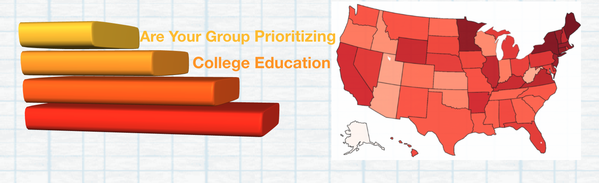

<h3 style="text-align: center;" markdown="1">Exploring the college attendance rate in the United States</h3>   
<h6 style="text-align: center;" markdown="1">By: Zhiye Lou (zl2978) |  Chen Mo (cm4047) |  Wenzhao Wu (ww2579)  | Zhixin Yang (zy2440)</h6>

{width=900px}

 

## {.tabset .tabset-pills}  
### Introduction
It is undoubtedly that there are numerous of people are living in extreme poverty, and this also happened to the United States. One noticeable situation is that people with college or higher degrees are tend to earn more than others. Besides, one of the major social issues in the United States is the inequality in the higher education, and thus the college attendance rate really matters for reducing poverty in the United States. So our team is trying to find the relevant factors which influence the college attendance rate in the United States.   

In this project, with a dataset from IMPUS, we examined the factors influenced the college attendance rate. In particular, we are interested in:  

- Any association between different income groups and the college attendance rate?  
- Any association between geography (states and if from an urban) and the college attendance rate?
- Any association between races and the college attendance rate?  
- Any association between different income groups and the school type?  
- What are the important variables if we do a multiple linear regression?
- How can we predict and visualize the college attendance rate among different groups?
- An national map which shows the details about the college attendance rate and the college type

### Data
The dataset we are using is IMPUS which provides census and survey data from around the world integrated across time and space. 

Since we were interested in the college attendance rate, we filtered the dataset to only include age between 18 to 24 years old. Besides, we only keep part of the original dataset because it is too big, and the final cleaned data has around 120,000 rows. 

We considered people who were currently enrolled in the college (including students who take a gap year from the university) or have graduated from the college before as the numerator of the college attendance rate.  

Factors that we are interested in: 
  
 * year: Census year  
 * age: Age
 * states: States abbreviation  
 * race: Race  
 * number_of_children: Number of own children in the household  
 * college_attendance_status: if one is enrolled in the college  
 * school_type: Public or Private school  
 * anually_family_income: Total anually family income

### Screecast

<iframe width="560" height="315" src="https://www.youtube.com/embed/-qg7T4e-go8" frameborder="0" allow="accelerometer; autoplay; clipboard-write; encrypted-media; gyroscope; picture-in-picture" allowfullscreen></iframe>

